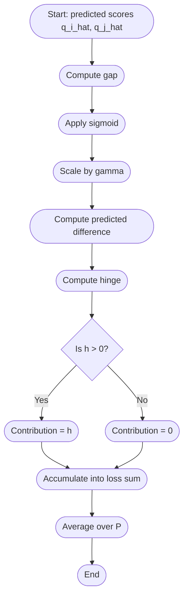

# Adaptive Margin Ranking Loss (AMRL)

> **Motivation:**  
> The original ranking loss uses a fixed margin for all pairs. AMRL makes the margin *adaptive* to the predicted quality gap — large quality gaps produce larger margins, while small gaps are treated more leniently.

---

## Mathematical formulation

\[
\mathcal{L}_{\text{AMRL}} = \frac{1}{|P|} \sum_{(i,j)\in P} \max\bigl(0,\; m_{ij} - (\hat{q}_i - \hat{q}_j)\bigr)
\]

where
\[
m_{ij} = \gamma \cdot \operatorname{sigmoid}\bigl(|\hat{q}_i - \hat{q}_j|\bigr)
\]

- \(P = \{(i,j): \hat{q}_i > \hat{q}_j\}\) — all ordered pairs where sample \(i\) should be ranked above sample \(j\).  
- \(\hat{q}_i\) — predicted quality score for sample \(i\).  
- \(m_{ij}\) — adaptive margin for pair \((i,j)\).  
- \(\gamma\) — maximum margin (typical values: \(0.5\) to \(1.0\)).  

**Interpretation:** the hinge term \(\max(0, m_{ij} - (\hat{q}_i - \hat{q}_j))\) penalizes the model only if the predicted score gap \((\hat{q}_i - \hat{q}_j)\) is smaller than the adaptive margin \(m_{ij}\).

---

## Why it works

- **Adaptive tolerance:** When the predicted or true quality gap is small, the margin shrinks — we allow small errors without a heavy penalty.  
- **Stronger separation for large gaps:** When items differ a lot in quality, the margin increases, forcing the model to produce a larger predicted gap.  
- **Smooth scaling:** Using a sigmoid on \(|\hat{q}_i - \hat{q}_j|\) yields a smooth, bounded margin in \([0, \gamma]\).

---

## Components & variables (concise)

- \( \hat{q}_i, \hat{q}_j \) — predicted scores for items \(i\) and \(j\).  
- \( P = \{(i,j) : \hat{q}_i > \hat{q}_j\} \) — ordered pair set used in the summation.  
- \( m_{ij} = \gamma \cdot \operatorname{sigmoid}(|\hat{q}_i - \hat{q}_j|) \) — adaptive margin.  
- \( \gamma \) — max margin hyperparameter (e.g. \(0.5\)–\(1.0\)).  
- Loss is averaged by dividing by \(|P|\).

---

## Pseudocode

```python
# Pseudocode for one minibatch
# inputs: q_hat: array of predicted scores, gamma: float
pairs = [(i, j) for i in range(n) for j in range(n) if q_hat[i] > q_hat[j]]
loss = 0.0
for i, j in pairs:
    gap = abs(q_hat[i] - q_hat[j])
    m_ij = gamma * sigmoid(gap)
    margin_violation = max(0.0, m_ij - (q_hat[i] - q_hat[j]))
    loss += margin_violation
loss = loss / max(1, len(pairs))
```

